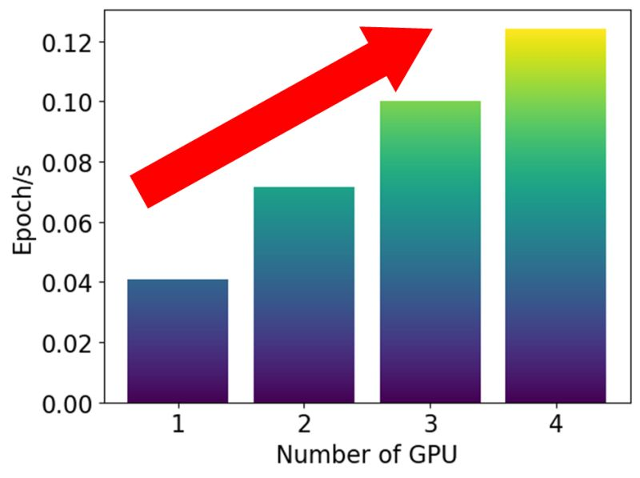

# Multi-GPU acceleration with Pytorch Data Parallelism

This repository demonstrates how to have a multi-GPU acceleration with data parallelism using Pytorch DDP (Distributed Data-Parallel).

## Installation

To install necessary libraries to run the codes in this repository, you can run the following bash command:

```bash
pip install torch torchvision
```

## Single-GPU acceleration with Pytorch

It is easier to learn how to use Pytorch DDP by comparing it to the standard Pytorch code that runs in a single GPU. The code is provided in [single_gpu_cifar10.py](single_gpu_cifar10.py). To run this code, you can execute the following bash command:

```bash
python single_gpu_cifar10.py <TOTAL_EPOCHS> <SAVE_EVERY> --batch_size <BATCH_SIZE>
```

`<TOTAL_EPOCHS>` is the number of epochs to train the model. The model will be saved for every `<SAVE_EVERY>` epoch. `<BATCH_SIZE>` is the size of each batch (default=32).

Example for 1 epoch, save every 1 epoch, and batch size is 1916 (the largest batch size with NVIDIA H100 SXM).

```bash
python single_gpu_cifar10.py 1 1 --batch_size 1916
```


## Multi-GPU acceleration with Pytorch

The code for multi-GPU acceleration with Pytorch DDP is provided in [multigpu_cifar10.py](multigpu_cifar10.py). To run this code, you can execute the following bash command:

```bash
python multigpu_cifar10.py <TOTAL_EPOCHS> <SAVE_EVERY> --batch_size <BATCH_SIZE> --gpu_num <GPU_NUM>
```

The first three parameters are the same as in the single GPU code. `<GPU_NUM>` is the number of GPU you want to use (default 2).

Example with 4 GPUs:

```bash
python multigpu_cifar10.py 1 1 --batch_size 1916 --gpu_num 4
```

## Result

Below is the visualization of the epoch/s with 1 GPU to 4 GPUs. As expected, the epoch/s is getting larger with more GPUs.

